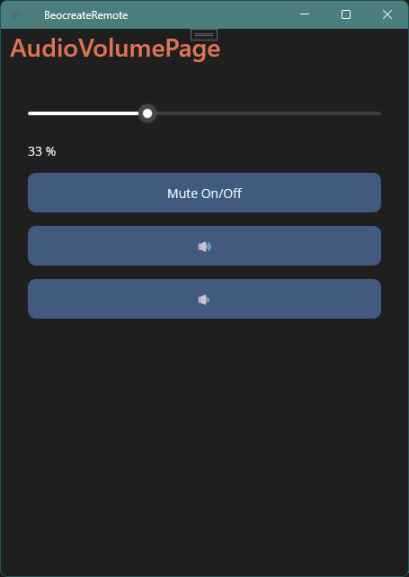

# 🎵 Beocreate Remote 🎚️

This is a small app to control the soundboard [HifiBerry Beocreate](https://www.hifiberry.com/beocreate/) on top of a Raspberry Pi.

It's my first mobile app in DotNet MAUI, so be gentle.

## 📜 HowTo

The app has been made to work with the [dsptoolkit](https://github.com/hifiberry/hifiberry-dsp/) installed on top of [OSMC](https://osmc.tv/) .

It has been tested only on a Pixel 4a ( Android 13 ).

